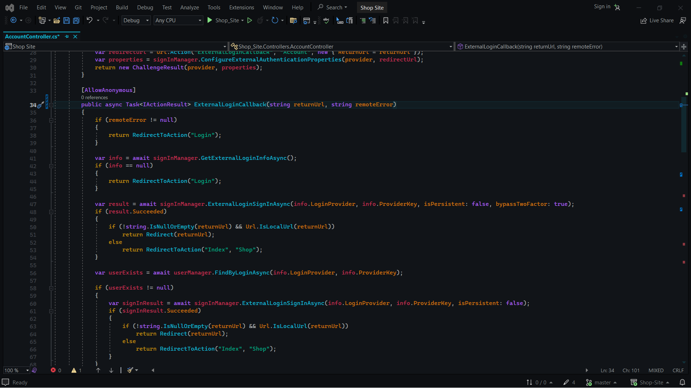
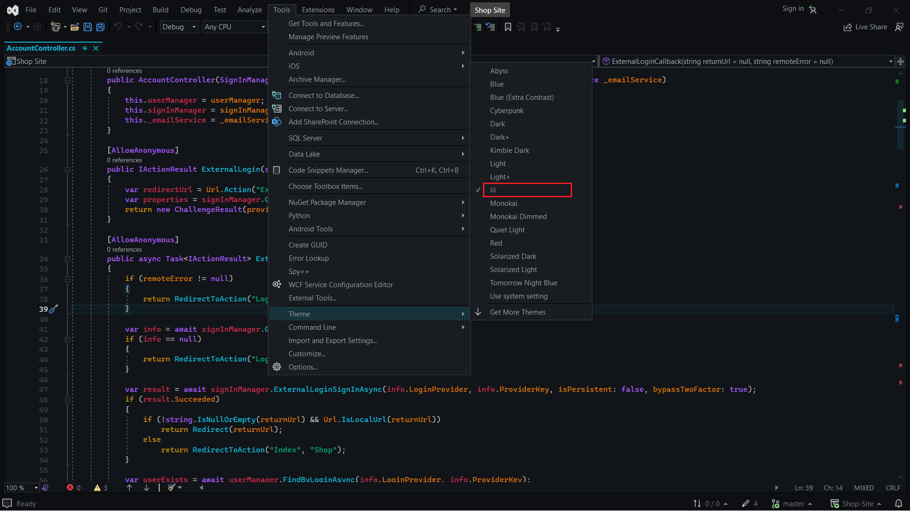

# Lil - Visual Studio Theme



## Installation

### Step 1: Download and Extract

1. **Download:** Grab the latest release from the [releases page](https://github.com/your-username/Lil/releases).
2. **Extract:** Unzip the downloaded file to reveal its contents.

### Step 2: Copy `lil.pkgdef`

1. **Locate File:** Find the `lil.pkgdef` file within the extracted folder.
2. **Copy:** Copy the `lil.pkgdef` file to your clipboard.

### Step 3: Paste into Visual Studio Directory

1. **Navigate:** Go to `C:\Program Files\Microsoft Visual Studio\2022\Community\Common7\IDE\CommonExtensions\Platform` on your machine.
2. **Paste:** Paste the previously copied `lil.pkgdef` file into this directory.

### Step 4: Update Visual Studio Configuration

1. **Launch Developer Command Prompt:** Open a Developer Command Prompt.
2. **Run Command:** Execute the following command to merge your pkgdef into Visual Studio:
   ```bash
   devenv /updateConfiguration
### Step 4: Select Lil Theme
1. **Open Visual Studio:** Launch Visual Studio.
2. **Navigate to Themes:** Go to the theme settings section.
3. **Choose Lil:** Find and select the "Lil" theme from the available options.
4. **Enjoy Coding:** Your Lil theme is now applied! Enjoy your coding experience with Lil.

Screenshots
---



License
---
***This project is licensed under the MIT License.***